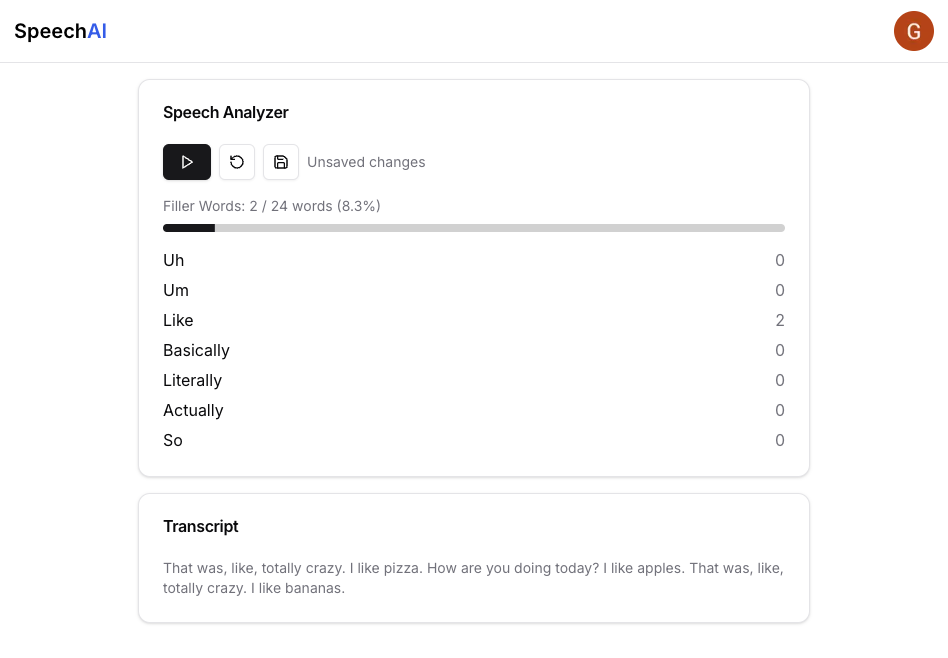

# SpeechAI

A full-stack web application that leverages AI and real-time speech processing to help users improve their public speaking skills. Built with Next.js, TypeScript, and Firebase.

## 🛠️ Technical Highlights

- **Real-time Speech Processing**: Implemented streaming speech recognition with WebSocket connections and Web Workers for non-blocking performance
- **Scalable Architecture**: Built with Next.js 13 App Router, featuring server-side analytics and client-side real-time updates
- **AI Integration**: Utilized Transformers.js for text analysis and Deepgram API for accurate speech-to-text conversion
- **Full-stack TypeScript**: End-to-end type safety across the entire application
- **Secure Payment Infrastructure**: Integrated Stripe with webhook handling for subscription management
- **NoSQL Database Design**: Structured Firebase collections for efficient user data and analytics storage
- **Authentication & Security**: Implemented Firebase Auth with secure role-based access control

## 🚀 Tech Stack

### Frontend

- Next.js 13 with App Router
- TypeScript
- Tailwind CSS
- Recharts for data visualization

### Backend & Infrastructure

- Firebase (Auth & Firestore)
- Stripe API with webhooks
- Deepgram Speech Recognition
- Transformers.js

## 🌟 Core Features

- Real-time filler word detection
- Interactive analytics dashboard
- Subscription management system
- Historical performance tracking
- Secure data storage and retrieval

## 🔗 Links

- [Live Demo](https://www.speechai.co/)
- [LinkedIn](https://www.linkedin.com/in/gabeavazquez/)

---

Built with ❤️ by Gabe Vazquez
